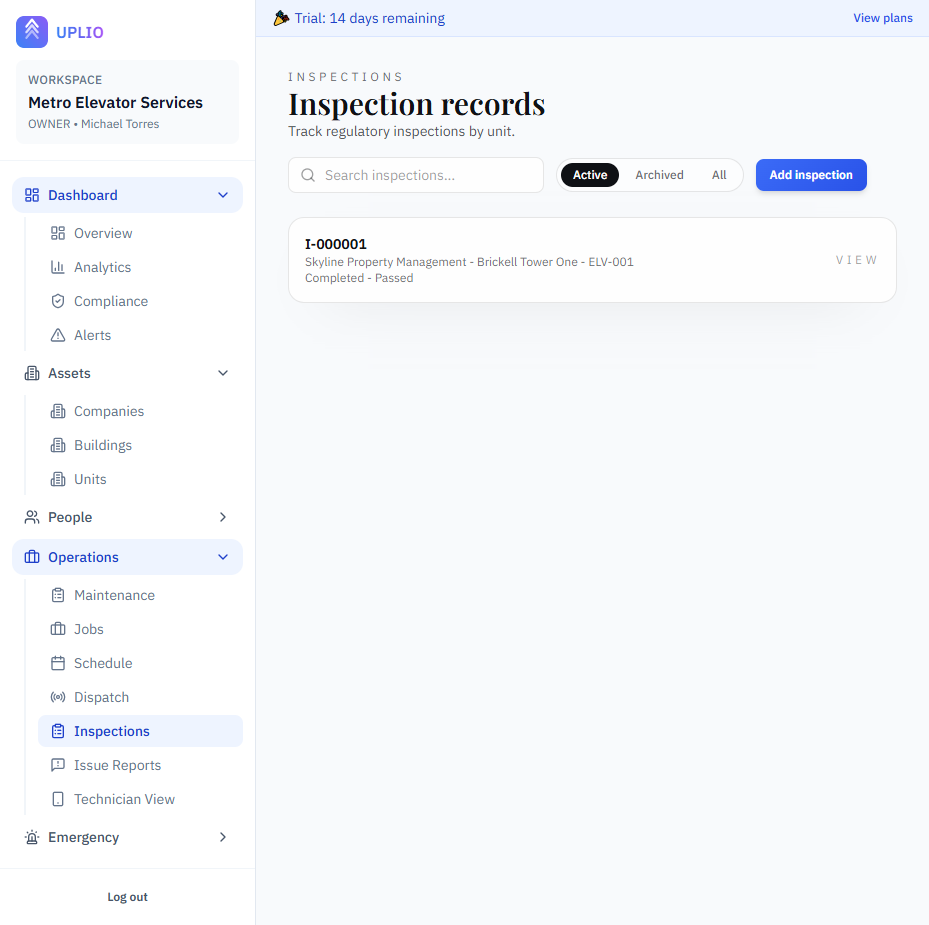

# Inspections

Inspections track regulatory inspection records for your elevator and escalator units. Proper inspection tracking is critical for compliance, safety, and customer trust.

---

## Accessing Inspections

1. Click **"Inspections"** under the **Operations** section in the sidebar
2. You'll see a list of all inspection records

---

## Understanding Inspections

### What is an Inspection Record?

An inspection record documents a regulatory inspection:
- When it was performed
- Which unit was inspected
- Who conducted the inspection
- The result (passed, failed, etc.)
- When the inspection expires

### Inspection vs. Maintenance

| Feature | Inspection | Maintenance |
|---------|------------|-------------|
| **Purpose** | Regulatory compliance | Routine service |
| **Performed By** | External inspectors | Your mechanics |
| **Has Expiration** | Yes | No |
| **Affects Compliance** | Yes | No |

---

## Viewing the Inspections List

### List Features

| Feature | Description |
|---------|-------------|
| **Search** | Filter by inspection code or notes |
| **Archive Filter** | Toggle between active, archived, or all |
| **Inspection Cards** | Click any record to view details |

### Inspection Card Information

Each card displays:
- **Inspection Code** — Auto-generated identifier (e.g., "INS-0001")
- **Location** — Management company, building, and unit
- **Status** — Current inspection status
- **Result** — Pass/Fail outcome (if set)

> 📸 *Screenshot: Inspection cards with status and result*

---

## Creating an Inspection

### Step-by-Step Instructions

1. Navigate to **Inspections** in the sidebar
2. Click **"Add inspection"** button (top right)
3. Fill in the inspection form
4. Click **"Create inspection"**

> 📸 *Screenshot: New inspection form*

### Inspection Form Fields

| Field | Required | Description | Example |
|-------|----------|-------------|---------|
| **Management Company** | Yes | Select the company | "Acme Properties" |
| **Building** | Yes | Select the building | "Downtown Tower" |
| **Unit** | Yes | Select the unit | "E-1" |
| **Inspection Date** | Yes | When inspection occurred | 2024-01-15 |
| **Expiration Date** | No | When inspection expires | 2025-01-15 |
| **Inspector** | No | Who performed inspection | "John Doe (City Inspector)" |
| **Status** | Yes | Current status | Scheduled, Completed, etc. |
| **Result** | No | Outcome of inspection | Passed, Failed, Conditional |
| **Report URL** | No | Link to inspection report | URL to document |
| **Notes** | No | Additional notes | "Minor violations noted..." |

---

## Inspection Codes

Each inspection receives an auto-generated code:
- Format: `INS-XXXX` (e.g., INS-0001, INS-0002)
- Codes are sequential per workspace
- Cannot be changed after creation

---

## Inspection Statuses

Configure your own inspection statuses in Lookup Values. Common examples:

| Status | Description |
|--------|-------------|
| **Scheduled** | Inspection is planned |
| **In Progress** | Inspector is on-site |
| **Completed** | Inspection finished |
| **Pending Report** | Waiting for official report |
| **Rescheduled** | Date changed |

> 📖 See [Lookup Values](../settings/lookup-values.md) for configuration.

---

## Inspection Results

Configure your own inspection results. Common examples:

| Result | Description |
|--------|-------------|
| **Passed** | Full compliance |
| **Failed** | Did not pass |
| **Conditional** | Passed with conditions |
| **Partial** | Some items passed |
| **Pending** | Result not yet determined |

---

## Expiration Dates and Compliance

### How Expiration Works

- Set the **Expiration Date** when recording an inspection
- The system tracks days until expiration
- Compliance dashboard shows units at risk

### Compliance Statuses

Based on expiration dates, units fall into categories:

| Status | Definition | Dashboard Impact |
|--------|------------|------------------|
| **Valid** | Not expired, more than 30 days remaining | ✅ Compliant |
| **Expiring Soon** | Expires within 30 days | ⚠️ Warning |
| **Overdue** | Expiration date has passed | ❌ Non-compliant |
| **Missing** | No inspection on record | ❌ Non-compliant |

---

## Viewing Inspection Details

### Accessing the Detail Page

Click any inspection from the list.

> 📸 *Screenshot: Inspection detail page*

### Detail Page Information

- **Inspection Code** — Unique identifier
- **Location** — Full path with links
- **Dates** — Inspection date and expiration
- **Inspector** — Who performed it
- **Status and Result** — Current state
- **Notes** — Additional information
- **Report Link** — If provided

### Actions Available

- **Edit** — Update inspection details
- **Archive/Restore** — Hide or restore
- **Delete** — Permanently remove (if allowed)

---

## Editing an Inspection

### Step-by-Step Instructions

1. Open the inspection detail page
2. Update any fields
3. Click **"Save changes"**

### Common Updates

- **Add result** after inspection is complete
- **Set expiration date** based on certificate
- **Update status** as process progresses
- **Link report** when available

---

## Assigning Inspectors

### Adding an Inspector

1. In the inspection form, select from the **Inspector** dropdown
2. Or create a new inspector if not listed

### No Inspector Listed?

If you need to add inspectors:
1. Navigate to **Inspectors** under People
2. Add the inspector's information
3. Return to create the inspection

> 📖 See [Inspectors](../people/inspectors.md) for managing inspector records.

---

## Compliance Tracking

### Dashboard Compliance Rate

Your dashboard shows:
- **Compliance Rate %** — Percentage of units with valid inspections
- **Expiring Soon Count** — Units expiring within 30 days

### Compliance Page

View detailed compliance breakdown:
1. Click **"Compliance"** in the sidebar
2. See three sections:
   - **Overdue** — Expired inspections
   - **Expiring Soon** — Within 30 days
   - **Missing** — No inspection recorded

Each section links directly to the affected unit or inspection.

### Alerts Page

The Alerts page lists:
- Overdue inspections (High severity)
- Expiring soon (Medium severity)
- Missing inspections (High severity)

---

## Archiving Inspections

### When to Archive

- Outdated inspection records
- Duplicate entries
- Records replaced by newer inspections

### How to Archive

1. Open the inspection detail page
2. Click the **⋮** menu button
3. Select **"Archive"**

> 💡 **Note:** Archiving old inspections doesn't affect compliance. Only the most recent inspection per unit is counted.

---

## Deleting an Inspection

### How to Delete

1. Open the inspection detail page
2. Click the **⋮** menu button
3. Select **"Delete"**
4. Confirm deletion

> ⚠️ **Warning:** Deletion is permanent and affects compliance history.

---

## Best Practices

### Recording Inspections

- Enter inspections promptly after they occur
- Always set the expiration date
- Link to official reports when possible
- Include inspector information

### Expiration Management

- Monitor the Compliance page regularly
- Plan re-inspections before expiration
- Set up inspection reminder notifications

### Documentation

- Upload inspection reports to the unit
- Keep detailed notes on findings
- Document any violations or conditions

### Staying Ahead

- Use the Compliance Forecast on the dashboard
- Schedule re-inspections 30-60 days before expiration
- Track inspectors' availability

---

## Notifications

Uplio can send email reminders for upcoming inspection expirations:
- **Inspection Reminders** — Alerts when inspections are expiring soon

Enable in Settings > Notification Preferences.

> 📖 See [Settings](../settings/team.md) for notification configuration.

---

## Permissions

| Role | Can View | Can Create | Can Edit | Can Archive | Can Delete |
|------|----------|------------|----------|-------------|------------|
| **Owner** | ✅ | ✅ | ✅ | ✅ | ✅ |
| **Admin** | ✅ | ✅ | ✅ | ✅ | ✅ |
| **Member** | ✅ | ❌ | ❌ | ❌ | ❌ |

---

## Related Features

- [Compliance Dashboard](../dashboard.md) — Monitor overall compliance
- [Units](../assets/units.md) — View unit inspection history
- [Inspectors](../people/inspectors.md) — Manage inspector contacts
- [Lookup Values](../settings/lookup-values.md) — Configure statuses and results

---

*Inspection tracking keeps you compliant and your customers safe. Stay on top of expirations to avoid regulatory issues.*

