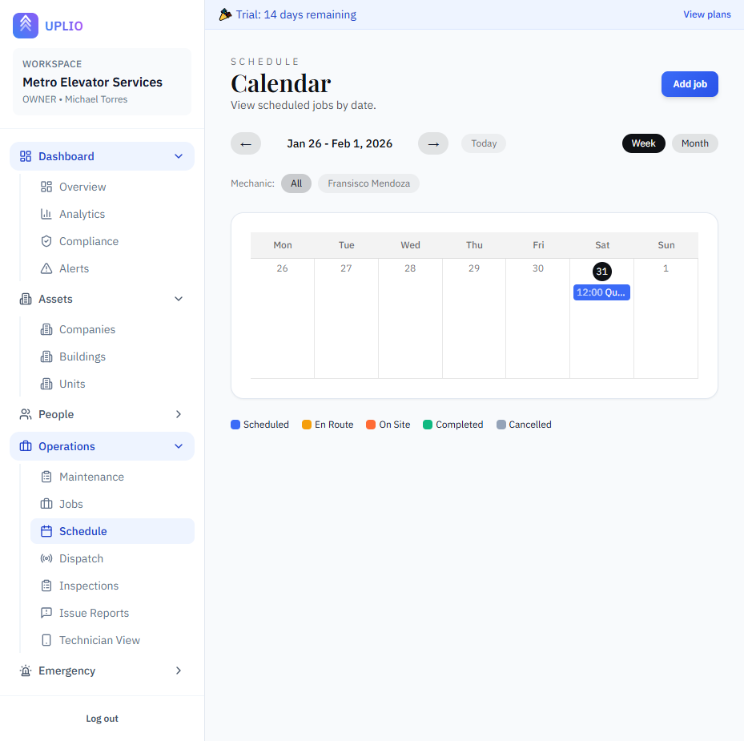
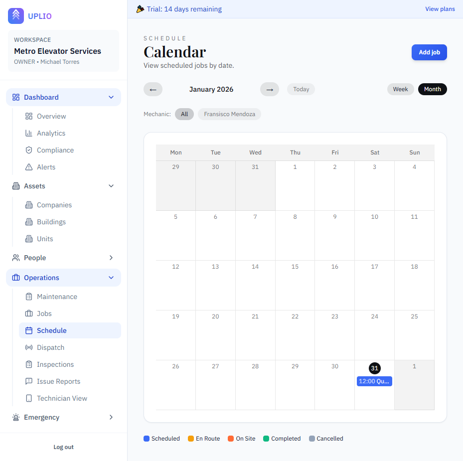

# Schedule (Calendar View)

The Schedule provides a visual calendar view of all your scheduled jobs. Use it to see workload distribution, plan ahead, and manage job assignments by date.

---

## Accessing the Schedule

1. Click **"Schedule"** under the **Operations** section in the sidebar
2. You'll see a calendar view of scheduled jobs

---

## Calendar Views

### Week View

The default view showing 7 days (Monday through Sunday):
- Each day is a column
- Jobs appear as colored blocks within each day
- Scroll to see more jobs if a day is busy

### Month View

A traditional monthly calendar layout:
- Full month at a glance
- Up to 3 jobs visible per day
- "+X more" indicator if more jobs exist
- Previous/next month days shown in lighter color

### Switching Views

Use the view toggle buttons:
- Click **"Week"** for detailed weekly view
- Click **"Month"** for monthly overview

---

## Navigating the Calendar

### Moving Through Time

| Control | Action |
|---------|--------|
| **← (Left arrow)** | Previous week or month |
| **→ (Right arrow)** | Next week or month |
| **Today** | Jump back to current date |

### Date Header

The header shows:
- Current date range (e.g., "Jan 15 - Jan 21, 2024")
- For month view: Month and year (e.g., "January 2024")

---

## Understanding Job Cards

### Color Coding (Status)

| Color | Status | Meaning |
|-------|--------|---------|
| 🔵 Blue | SCHEDULED | Job is planned |
| 🟡 Yellow | EN_ROUTE | Mechanic traveling to site |
| 🟠 Orange | ON_SITE | Work in progress |
| 🟢 Green | COMPLETED | Work finished |
| ⚪ Gray | CANCELLED | Job cancelled |

### Job Card Information

Each job on the calendar shows:
- **Start time** (if set)
- **Title** — Brief job description

Click any job to open its detail page.

---

## Today Indicator

The current day is highlighted:
- Today's date number appears in a circle
- Helps you quickly find "now" on the calendar

---

## Filtering by Mechanic

Filter the calendar to show only one mechanic's jobs:

1. Find the **Mechanic** filter row below the navigation
2. Click **"All"** to see all jobs
3. Click a mechanic's name to filter

This helps you see individual workload and schedule.

---

## Creating Jobs from Schedule

You can add new jobs directly:

1. Click **"Add job"** button (top right of Schedule page)
2. Complete the job form
3. The new job appears on the calendar

> 📖 See [Jobs](./jobs.md) for detailed job creation.

---

## Viewing Job Details

1. Click any job block on the calendar
2. You'll be taken to the job detail page
3. From there, you can edit, update status, or manage the job

---

## Calendar Legend

A legend at the bottom explains the status colors:
- **Scheduled** — Blue
- **En Route** — Yellow
- **On Site** — Orange
- **Completed** — Green
- **Cancelled** — Gray

---

## Week View Features

### Time-Based Layout

- Each day column can show multiple jobs
- Jobs are ordered by start time (earliest first)
- Jobs without times appear at the top

### Job Density

When many jobs are scheduled for one day, you can scroll within that day to see all jobs.

---

## Month View Features

### Limited Display

Due to space constraints:
- Only first 3 jobs per day are shown
- **"+X more"** link indicates additional jobs
- Click the date to see all jobs for that day

### Current Month Highlighting

- Days in the current month have a white background
- Days from previous/next month are slightly grayed

---

## Schedule vs. Dispatch

| Feature | Schedule | Dispatch |
|---------|----------|----------|
| **Purpose** | Calendar planning | Real-time operations |
| **View** | Week/Month calendar | Today-focused lists |
| **Time Range** | Any date | Today and upcoming |
| **Best For** | Planning ahead | Managing current work |

> 💡 **Tip:** Use Schedule for planning and Dispatch for daily operations.

---

## Tips for Using the Schedule

### Planning Ahead

1. Switch to month view
2. Identify busy vs. light days
3. Balance workload across the week
4. Avoid overloading individual mechanics

### Checking Mechanic Availability

1. Use the mechanic filter
2. Review their scheduled jobs
3. Find open slots for new work
4. Consider travel time between jobs

### End-of-Day Review

1. Switch to week view
2. Check today and tomorrow
3. Verify all jobs have mechanics assigned
4. Confirm priorities are correct

### Weekly Planning

1. Use week view
2. Review the upcoming week
3. Ensure coverage for all scheduled jobs
4. Identify gaps or conflicts

---

## Keyboard Navigation

Standard browser shortcuts work:
- **Arrow keys** — Navigate (when focused)
- **Tab** — Move between elements
- **Enter** — Select/click

---

## Mobile Usage

The Schedule is responsive:
- On small screens, the view adapts
- Week view may show fewer days
- Horizontal scrolling available if needed

For mobile-optimized scheduling, consider the [Technician View](../technician-view.md).

---

## Troubleshooting

### Jobs Not Appearing

- Check the mechanic filter — make sure "All" is selected
- Verify the date range — navigate to the correct week/month
- Check the job's scheduled date — it must match the calendar date
- Ensure the job isn't archived

### Wrong Day Display

- Jobs appear on their **scheduled date**
- If a job seems on the wrong day, edit the job and verify the date

---

## Permissions

All users can view the Schedule.

| Role | Can View | Can Create Jobs | Can Edit Jobs |
|------|----------|-----------------|---------------|
| **Owner** | ✅ | ✅ | ✅ |
| **Admin** | ✅ | ✅ | ✅ |
| **Member** | ✅ | ❌ | ❌ |

---

## Related Features

- [Jobs](./jobs.md) — Create and manage individual jobs
- [Dispatch](./dispatch.md) — Real-time daily operations
- [Mechanics](../people/mechanics.md) — Manage your field technicians

---

*The Schedule is your visual planning tool. Use it to see the big picture and plan your team's work.*

