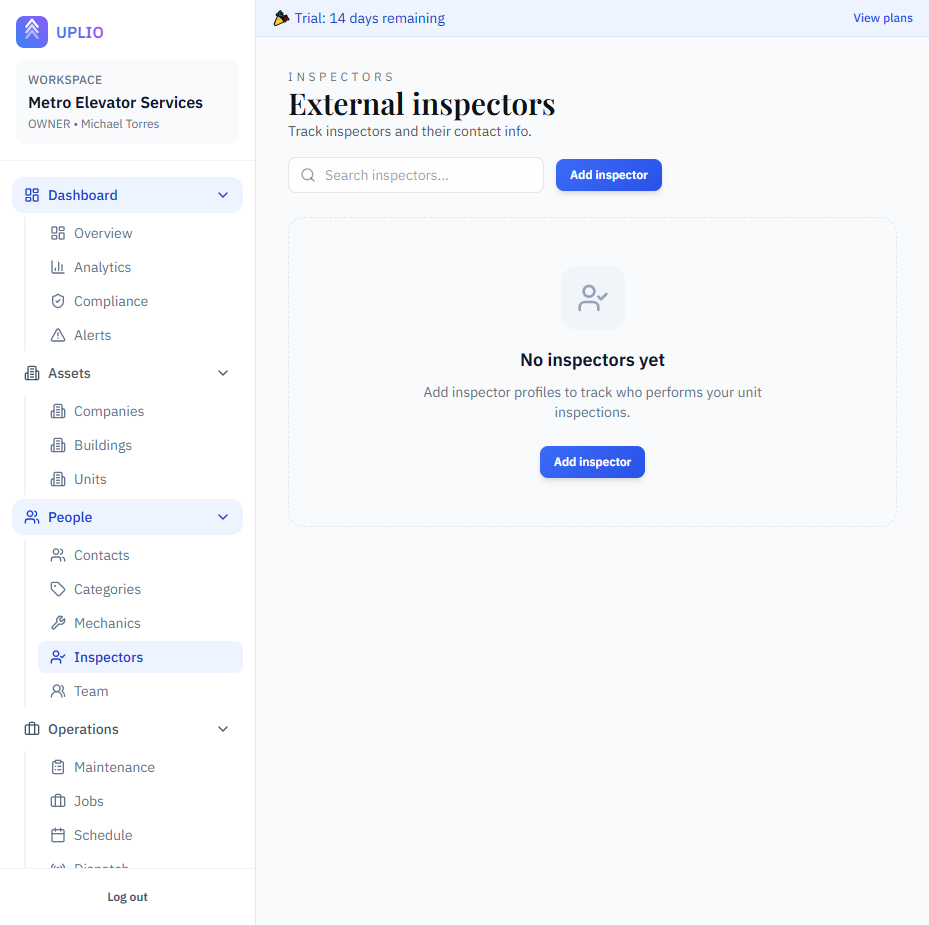

# Inspectors

Inspectors are external personnel who conduct regulatory inspections on elevator and escalator units. These are typically government inspectors, third-party certification officials, or authorized inspection agencies. Tracking inspectors helps you maintain accurate inspection records and plan for future inspections.

---

## Accessing Inspectors

1. Click **"Inspectors"** under the **People** section in the sidebar
2. You'll see a list of all inspector records in your workspace

---

## Understanding Inspector Records

### What is an Inspector Record?

An inspector record stores:
- Inspector's personal information
- Their company or agency
- Contact details
- Active/inactive status

### Inspectors vs. Mechanics

| Feature | Inspectors | Mechanics |
|---------|------------|-----------|
| **Employed by** | External agencies | Your company |
| **Performs** | Regulatory inspections | Service work |
| **Assigned to** | Inspection records | Jobs, maintenance, emergencies |

---

## Viewing the Inspectors List

### List Features

| Feature | Description |
|---------|-------------|
| **Search** | Filter by name, company, email, or phone |
| **Inspector Cards** | Click to view full details |

### Inspector Card Information

Each card displays:
- **Full Name** — First and last name
- **Company** — Inspection agency or employer
- **Contact** — Email (if provided)
- **Status** — Active or Inactive badge

> 📸 *Screenshot: Inspector cards*

---

## Creating an Inspector

### Step-by-Step Instructions

1. Navigate to **Inspectors** in the sidebar
2. Click **"Add inspector"** button (top right)
3. Fill in the inspector form
4. Click **"Create inspector"**

> 📸 *Screenshot: New inspector form*

### Inspector Form Fields

| Field | Required | Description | Example |
|-------|----------|-------------|---------|
| **First Name** | Yes | Inspector's first name | "Robert" |
| **Last Name** | Yes | Inspector's last name | "Johnson" |
| **Company Name** | No | Their employer/agency | "City DOB" |
| **Email** | No | Contact email | "rjohnson@city.gov" |
| **Phone** | No | Contact phone number | "(555) 234-5678" |
| **Active** | Yes | Whether currently available | ✅ Yes / ❌ No |

---

## Viewing Inspector Details

### Accessing the Detail Page

Click any inspector from the list.

> 📸 *Screenshot: Inspector detail page*

### Detail Page Information

- **Full Name** — Inspector's name
- **Company** — Agency or organization
- **Contact Info** — Email and phone
- **Status** — Active or inactive

### Actions Available

- **Edit** — Update inspector information
- **Toggle Active** — Change status
- **Delete** — Remove if no related records

---

## Editing an Inspector

### Step-by-Step Instructions

1. Open the inspector detail page
2. Update any fields in the form
3. Click **"Save inspector"**

### Common Updates

- **Update contact info** — New phone or email
- **Change company** — If they moved agencies
- **Toggle active status** — If they're no longer available

---

## Active vs. Inactive Status

### Active Inspectors

- Appear in inspection record dropdowns
- Can be assigned to new inspections

### Inactive Inspectors

- Hidden from dropdowns
- Historical records preserved
- Can be reactivated later

### When to Deactivate

- Inspector retired or transferred
- Agency changed inspection personnel
- No longer conducting inspections in your area

---

## Assigning Inspectors to Inspections

When creating or editing an inspection:

1. Open the inspection form
2. Find the **Inspector** dropdown
3. Select from available inspectors
4. Save the inspection

> 📖 See [Inspections](../operations/inspections.md) for details.

---

## Deleting an Inspector

### Prerequisites

An inspector can only be deleted if they have:
- No assigned inspection records

### How to Delete

1. Open the inspector detail page
2. Click the **⋮** menu button
3. Select **"Delete"**
4. Confirm the permanent deletion

> ⚠️ **Warning:** Instead of deleting, consider deactivating to preserve history.

---

## Searching Inspectors

The search box filters inspectors by:
- First name
- Last name
- Company name
- Email
- Phone number

Type any text to instantly filter the list.

---

## Best Practices

### Complete Records

- Include company name for official inspections
- Add contact details when available
- Note the agency or jurisdiction

### Naming Conventions

- Use the inspector's full legal name
- Match official inspection documents
- Be consistent with titles (e.g., don't mix "Robert" and "Bob")

### Company Information

- Include the full agency name
- Examples: "NYC DOB", "State of California DLSE", "XYZ Inspection Services"
- Helps identify which jurisdiction inspects which buildings

### Tracking Inspector History

- Keep inactive inspectors in the system
- New inspection? Check if their inspector is still active
- Update when you learn of personnel changes

### Multiple Jurisdictions

If you serve multiple jurisdictions:
- Create inspectors for each area
- Use company name to distinguish
- Know which inspector covers which buildings

---

## Permissions

| Role | Can View | Can Create | Can Edit | Can Delete |
|------|----------|------------|----------|------------|
| **Owner** | ✅ | ✅ | ✅ | ✅ |
| **Admin** | ✅ | ✅ | ✅ | ✅ |
| **Member** | ✅ | ❌ | ❌ | ❌ |

---

## Related Features

- [Inspections](../operations/inspections.md) — Track inspection records
- [Compliance Dashboard](../dashboard.md) — Monitor inspection compliance
- [Units](../assets/units.md) — View unit inspection history

---

*Inspector records help you track who certifies your equipment. Keep them current for accurate inspection documentation.*

